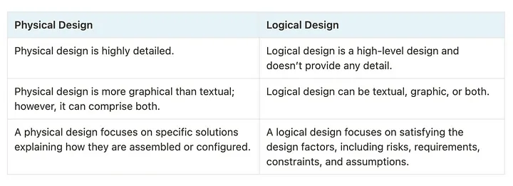
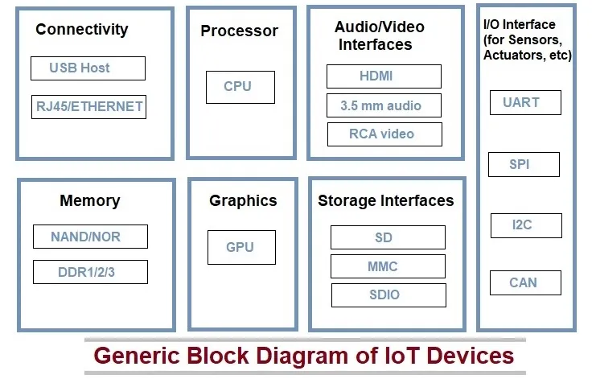
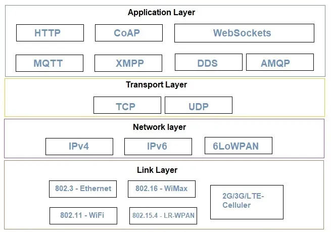
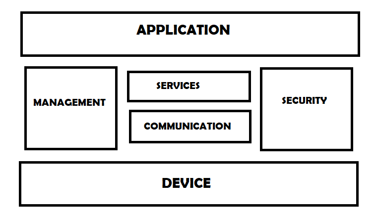

[**_``Go Back``_**](../README.md)

# Introduction to IOT

## Defination and Characterstics of IOT

The ``Internet of Things (IoT)`` refers to the interconnection of everyday physical objects to the internet, allowing them to send and receive data. These objects, often referred to as "smart" devices, can include anything from household appliances, vehicles, wearable devices, industrial machines, and more. The purpose of IoT is to create a network of interconnected devices that can communicate with each other and be controlled remotely, leading to increased automation, efficiency, and data-driven decision-making.

### Characteristics of IoT:

- ``Connectivity and Communication``: IoT devices are interconnected via the internet, using various communication protocols to exchange data with each other and central systems.

- ``Sensors and Data Collection``: Equipped with sensors, IoT devices collect real-time data from their environment, measuring parameters such as temperature, motion, and light.

- ``Intelligence and Automation``: Embedded processors allow IoT devices to perform local data processing and automated decision-making based on predefined rules and sensor inputs.

- ``Scalability and Interoperability``: IoT systems are designed to scale easily, integrating new devices seamlessly, and ensuring interoperability through common standards and protocols.

- ``Security and Energy Efficiency``: Ensuring the security of IoT devices and data is critical, involving encryption and authentication, while devices are also designed to be energy-efficient for prolonged operation.

## Physical and Logical Design of IoT:

- **Physical Design of IoT**
- **Logical Design of IoT**

### Physical Design of IoT

A physical design of an IoT system refers to the individual node devices and their protocols that are utilized to create a functional IoT ecosystem.

- **Things/Devices** 
- **IoT Protocol**

#### Things/Devices

**Things/Devices** are used to build a connection, process data, provide interfaces, provide storage, and provide graphics interfaces in an IoT system. all these generate data in a form that can be analyzed by an analytical system and program to perform operations and used to improve the system.

- ``Connectivity``: Devices like USB hosts and ETHERNET are used for connectivity between the devices and the server.

- ``Processor``: A processor like a CPU and other units are used to process the data. these data are further used to improve the decision quality of an IoT system.

- ``Audio/Video Interfaces``: An interface like HDMI and RCA devices is used to record audio and videos in a system.

- ``Input/Output Interface``: To give input and output signals to sensors, and actuators we use things like UART, SPI, CAN, etc.

- ``Storage Interfaces``: Things like SD, MMC, and SDIO are used to store the data generated from an IoT device.

- ``Graphics``: Some IoT devices, especially those with complex graphical interfaces or multimedia functions, may include a GPU (Graphics Processing Unit) or a dedicated graphics accelerator. This allows the device to render high-quality images, video, and user interfaces efficiently.

#### IoT Protocol

**IoT protcols** help to establish Communication between IoT Device (Node Device) and Cloud based Server over the Internet. It help to sent commands to IoT Device and received data from an IoT device over the Internet. An image is given below. By this image you can understand which protocols used.

- ``Link Layer``: Determines how data is physically transmitted over a network’s medium (e.g., coaxial cable, radio waves). It defines how packets are coded and signaled by hardware.

    - ``802.3 – Ethernet``: Standard for wired LANs, defining the physical layer and MAC sub-layer for Ethernet networks.

    - ``802.11 – WiFi``: Specifies protocols for wireless LAN communication across various frequency bands (e.g., 2.4 GHz, 5 GHz).

    - ``802.16 – WiMAX``: Supports broadband wireless access in metropolitan areas, with versions for both fixed and mobile users.

    - ``802.15.4 – LR-WPAN``: Standards for low-cost, low-power wireless communication used in personal area networks like Zigbee.

    - ``2G/3G/4G – Mobile Communication``: Cellular network standards enabling IoT device communication over mobile networks.

- ``Network Layer``: Responsible for sending IP datagrams from the source to the destination network. It handles host addressing and packet routing using hierarchical IP addressing schemes like IPv4 and IPv6.

    - ``IPv4``: A 32-bit address system used for identifying devices on a network. Due to the limited number of available addresses, IPv6 was developed to replace IPv4.

    - ``IPv6``: The most recent IP version, using a 128-bit address, allowing for a vastly larger number of unique addresses, addressing the issue of IPv4 exhaustion. 

    - ``6LoWPAN``: Stands for IPv6 over Low-Power Wireless Personal Area Networks. It enables small, low-power devices to communicate wirelessly using IPv6, compatible with 802.15.4 and other devices on an IP network like WiFi. 

- ``Transport Layer``: This layer handles error control, segmentation, flow control, and congestion control. It ensures end-to-end message transfer independent of the underlying network.

    - ``TCP (Transmission Control Protocol)``: A reliable, connection-oriented protocol that establishes and maintains a network conversation, enabling data exchange between applications. TCP works with IP and is fundamental to the Internet. 

    - ``UDP (User Datagram Protocol)``: A simpler, connectionless protocol that is part of the Internet Protocol suite. Unlike TCP, UDP is unreliable, meaning it does not guarantee message delivery, making it suitable for applications where speed is critical.

- ``Application Layer``: Defines how applications interact with lower-layer protocols to send data over a network.

    - ``HTTP (Hypertext Transfer Protocol)``: A widely-used protocol for transmitting hypermedia documents, such as HTML, primarily between web browsers and servers. It is stateless, following a client-server model, typically using TCP for reliable communication.

    - ``CoAP (Constrained Application Protocol)``: A protocol designed for simple hardware and constrained networks, such as low-power sensors. It simplifies HTTP, running over UDP to save bandwidth, and is used in IoT applications.

    - ``WebSocket``: Enables two-way communication between a client and a remote host, typically used in browser-based applications that require real-time data exchange without the overhead of multiple HTTP connections.

    - ``MQTT (Message Queuing Telemetry Transport)``: A lightweight publish/subscribe protocol designed for M2M/IoT communication, especially useful for connections in remote locations with limited bandwidth.

    - ``XMPP (Extensible Messaging and Presence Protocol)``: An XML-based protocol for near-real-time communication, originally developed for instant messaging but also used in IoT, VoIP, and social networking.

    - ``DDS (Data Distribution Service)``: A middleware protocol for data-centric connectivity, providing low-latency, reliable communication in distributed systems, commonly used in mission-critical IoT applications.

    - ``AMQP (Advanced Message Queuing Protocol)``: A protocol for messaging middleware, allowing applications to communicate with a broker service that routes and stores messages, ensuring reliable message delivery in distributed systems.

### Logical Design of IoT

A logical design for an IoT system is the actual design of how its components (computers, sensors, and actuators) should be arranged to complete a particular function. It doesn’t go into the depth of describing how each component will be built with low-level programming specifics.

IoT logical design includes:

- **IoT Functional Blocks**
- **IoT Communication Models**
- **IoT Communication APIs**

#### IoT Functional Blocks

An IoT system comprises of a number of functional blocks that provide the system the capabilities for identification, sensing, actuation, communication and management.

functional blocks are:

- ``Device``: An IoT system comprises of devices that provide sensing, actuation, monitoring and control functions.

- ``Communication``: Handles the communication for the IoT system.

- ``Services``: services for device monitoring, device control service, data publishing services and services for device discovery.

- ``Management``: this blocks provides various functions to govern the IoT system.

- ``Security``: this block secures the IoT system and by providing functions such as authentication , authorization, message and content integrity, and data security.

- ``Application``: This is an interface that the users can use to control and monitor various aspects of the IoT system. Application also allow users to view the system status and view or analyze the processed data.

#### IoT Communication Models

- ``Request-Response Model``
    - ``Description``: In this model, the client sends a request to the server, which processes the request and sends back a response. Each request and response pair is independent and stateless.
    - ``Example``: A web browser (client) requests a webpage from a server, which responds with the webpage content.
- ``Publish-Subscribe Model``
    - ``Description``: Publishers send data to topics managed by a broker. Consumers subscribe to these topics and receive data from the broker. Publishers and consumers do not interact directly.
    - ``Example``: A weather sensor (publisher) sends data to a topic, and multiple weather applications (consumers) receive updates from that topic.
- ``Push-Pull Model``
    - ``Description``: Producers push data into queues, and consumers pull data from these queues. This model decouples producers from consumers and uses queues to buffer data and handle rate mismatches.
    - ``Example``: A sensor (producer) pushes data to a queue, and a data analysis tool (consumer) pulls data from the queue.
- ``Exclusive Pair Model``
    - ``Description``: A bidirectional, full-duplex model with a persistent connection between client and server. Both can send messages to each other until the connection is closed. This model is stateful, with the server aware of open connections.
    - ``Example``: A chat application where both users (client and server) exchange messages in real-time over an open connection.

#### IoT Communication APIs

Generally we used Two APIs For IoT Communication. These IoT Communication APIs are:

- REST-based Communication APIs
- WebSocket-based Communication APIs

##### REST-based Communication APIs
``REST (Representational State Transfer)`` is an architectural style for designing networked applications. It uses standard HTTP methods and is stateless, meaning each request from a client to server must contain all the information needed to understand and process the request.

**Characteristics:**
- ``Stateless``: Each request from a client to server must contain all the information needed to understand and process the request.
- ``Standard Methods``: Uses standard ``HTTP`` methods such as ``GET``, ``POST``, ``PUT``, ``DELETE``.
- ``Resource-Based``: Resources are identified by URLs, and interactions with these resources are conducted via HTTP methods.
- ``Flexible Data Formats``: Typically uses JSON or XML for data exchange.
- ``Cacheable``: Responses can be cached to improve performance.

##### WebSocket-based Communication APIs
``WebSocket`` is a protocol that provides full-duplex communication channels over a single TCP connection. It allows for bidirectional communication between client and server, enabling real-time data transfer.

**Characteristics:**
- ``Full-Duplex``: Both client and server can send and receive messages simultaneously.
- ``Persistent Connection``: Once established, the connection remains open until closed by either party.
- ``Low Latency``: Ideal for applications requiring real-time updates, such as chat applications or live data feeds.
- ``Message Framing``: WebSocket messages are framed, allowing for efficient data transmission.

## IoT Enabled Technologies

IoT enabling technologies include:

- **Wireless Sensor Network (WSN)**: A network of distributed sensors that monitor environmental and physical conditions, transmitting data via routers to a coordinator, which connects to the internet. Example: weather monitoring systems.

- **Cloud Computing**: Provides remote access to resources like databases, storage, and software. It offers services like:

    - ``IaaS (e.g., AWS, Azure)``: Online infrastructure services.
    - ``PaaS (e.g., Google App Engine)``: Platforms for application development.
    - ``SaaS (e.g., Gmail, Google Docs)``: Software accessed over the internet.

- **Big Data Analytics**: Analyzing large volumes of data from various sources, including IoT systems. Examples: bank transactions, health data from fitness bands.

- **Communication Protocols**: Essential for enabling devices to exchange data over networks, ensuring connectivity and communication in IoT systems.

- **Embedded Systems**: Hardware-software combinations designed for specific tasks, such as data collection and internet connectivity. Examples: digital cameras, industrial robots.

## IoT and M2M

- **Internet of Things (IoT)**: ``IoT`` is an ecosystem of connected devices that communicate via the internet. Devices use sensors and actuators to send and receive data and can be controlled or monitored remotely. Examples include smart wearables and cloud-based systems.

- **Machine to Machine (M2M)**: ``M2M`` refers to direct communication between two or more machines without human interaction, often using mobile networks like GSM or CDMA. It's mainly used in security, tracking, and facility management. Examples include sensors and industrial devices.

### Differences between IoT and M2M:

- **Intelligence**: ``IoT`` devices make decisions, while ``M2M`` shows limited intelligence.
- **Connection**: ``IoT`` uses networks and the internet; ``M2M`` uses point-to-point connections without relying on the internet.
- **Protocols**: ``IoT`` uses internet protocols (e.g., HTTP), while ``M2M`` uses traditional communication methods.
- **Data Sharing**: ``IoT`` shares data broadly across applications, while ``M2M`` shares data only between communicating devices.
- **Communication Type**: ``IoT`` supports cloud communication; ``M2M`` uses point-to-point.
- **Scope**: ``IoT`` has a broader scope with both hardware and software, while ``M2M`` is more hardware-centric with limited scope.
- **Business**: ``IoT`` supports both B2B and B2C models, while ``M2M`` is mainly B2B.
- **API Support**: ``IoT`` supports open API integrations, ``M2M`` does not.
- **Components**: ``IoT`` includes sensors, connectivity, and user interfaces; ``M2M`` includes devices, networks, and application servers.

## Domain Specific IoTs: Home Automation, Cities, Environment, Energy. Retail, Logistics, Agriculture, Industry, Health and Lifestyle.

``Domain-specific IoT`` refers to the application of ``Internet of Things (IoT)`` technology tailored to meet the specific needs and challenges of particular industries or sectors. While IoT, in general, involves connecting devices, sensors, and systems to the internet for data collection, communication, and automation, domain-specific IoT goes a step further by customizing these technologies to address specialized use cases and requirements.

- **Home Automation**: IoT enables smart homes, controlling lighting, security, HVAC, and appliances remotely. Devices like smart thermostats, security cameras, and voice assistants enhance comfort and efficiency.

- **Smart Cities**: IoT systems manage traffic, public safety, waste, and utilities in urban areas. Connected sensors and infrastructure optimize resource use, reduce pollution, and improve quality of life.

- **Environment**: IoT helps monitor air and water quality, track pollution levels, and predict natural disasters, enabling better environmental management and early warnings.

- **Energy**: IoT enhances energy management, enabling smart grids, energy-efficient buildings, and predictive maintenance for power generation and distribution.

- **Retail**: IoT revolutionizes inventory tracking, supply chain management, and customer experiences. Smart shelves, RFID tags, and predictive analytics optimize operations.

- **Logistics**: IoT improves real-time tracking, route optimization, and inventory management in logistics, enhancing supply chain visibility and reducing costs.

- **Agriculture**: IoT applications in precision farming include soil monitoring, irrigation control, and crop health analysis, increasing productivity and sustainability.

- **Industry**: Industrial IoT (IIoT) automates manufacturing processes, predictive maintenance, and quality control, driving efficiency and reducing downtime.

- **Health and Lifestyle**: IoT in healthcare involves remote patient monitoring, wearables, and smart medical devices, improving diagnosis, treatment, and personal well-being management.

### Key Aspects of Domain-Specific IoT:

- **Customization**: Devices and systems are specifically designed or adapted to fit the operational needs of a particular industry, such as agriculture, healthcare, or manufacturing.
- **Focused Solutions**: Rather than generic IoT applications, domain-specific IoT targets the unique challenges and objectives of each sector, such as improving crop yields in agriculture or enhancing patient monitoring in healthcare.
- **Integration with Existing Infrastructure**: Domain-specific IoT often integrates with existing systems and processes within an industry, providing real-time insights, automation, and enhanced operational efficiency.
- **Scalability and Security**: Each domain may have distinct requirements for scalability and security, with critical sectors like healthcare and smart cities demanding robust security measures to protect sensitive data.